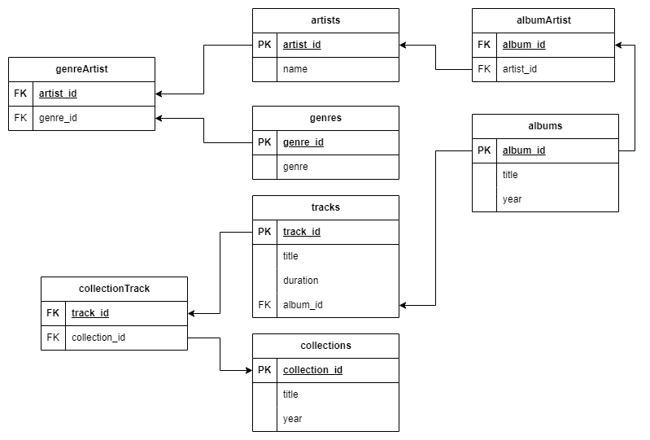
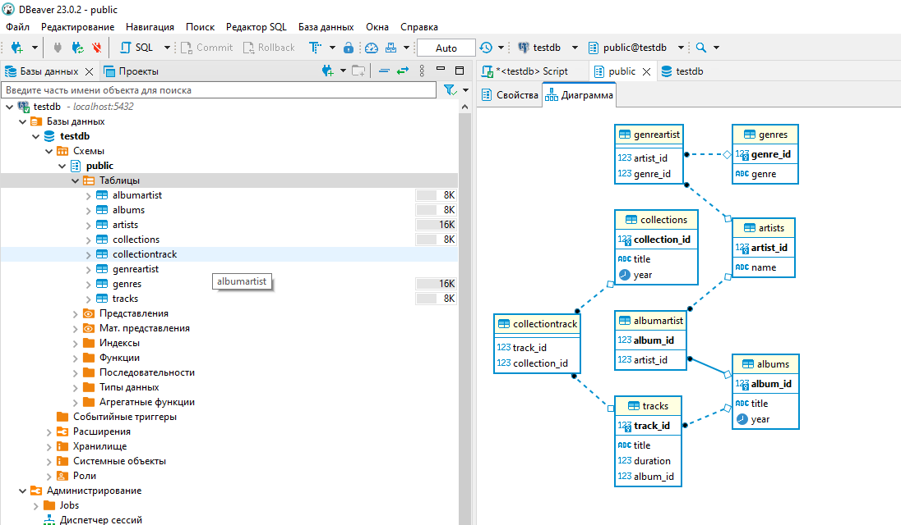

# Домашняя работа Работа с SQL. Создание БД  
## Схема спроектированной SQL базы данных  
  
  
## Код с запросами SQL для создания всех нужным таблиц и связей между ними находится в файле main.sql  
### Скриншот диаграммы созданных таблиц и связей между ними в DBeaver
